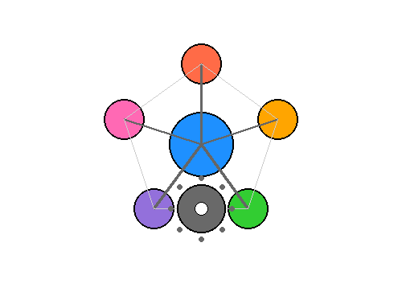

  
  
  

 

# 📊 Contributor Leaderboard (Updated Daily, Last 30 Days)

Below is a summary of the total commits for each contributor in the last 30 days 🚀

| Contributor  | Commits ✅ | 
|-------------| --------|
| [claestom](https://github.com/claestom) | 11 | 
| [nvandewalle](https://github.com/nvandewalle) | 0 | 
| [pmalarme](https://github.com/pmalarme) | 1 | 
| [jamelachahbar](https://github.com/jamelachahbar) | 0 | 
| [Nicwalle](https://github.com/Nicwalle) | 0 | 
| [kvaes](https://github.com/kvaes) | 0 | 

----

| Contributor  | Commits ✅ | Cross  repo commits 🆘 |
|-------------| --------| --------|
| [claestom](https://github.com/claestom) | 11 | 0 | 
| [nvandewalle](https://github.com/nvandewalle) | 0 | 0 | 
| [pmalarme](https://github.com/pmalarme) | 1 | 1 | 
| [jamelachahbar](https://github.com/jamelachahbar) | 0 | 0 | 
| [Nicwalle](https://github.com/Nicwalle) | 0 | 0 | 
| [kvaes](https://github.com/kvaes) | 0 | 0 | 

## 🏆 Leaderboard: Top 5 Contributors 

| Rank | Contributor | Commits ✅ |
|------|-------------|---------|
| 1 | [claestom](https://github.com/claestom) | 11 |
| 2 | [pmalarme](https://github.com/pmalarme) | 1 |
| 3 | [nvandewalle](https://github.com/nvandewalle) | 0 |
| 4 | [jamelachahbar](https://github.com/jamelachahbar) | 0 |
| 5 | [Nicwalle](https://github.com/Nicwalle) | 0 |

----

**Last updated**: 12-04-2026 07:47:57